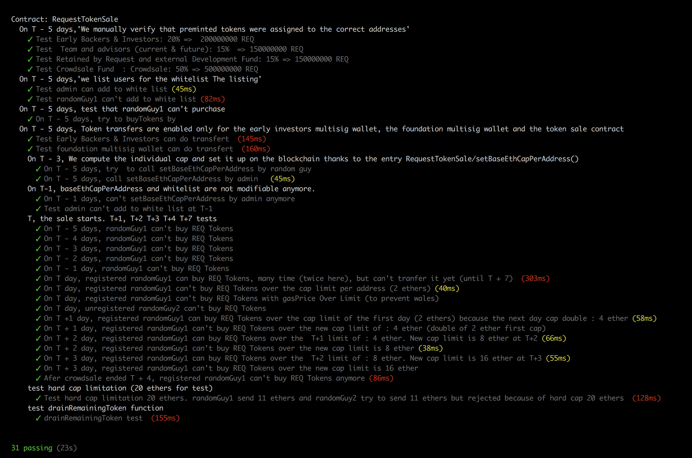

To launch additional additionaltests.js

you must install bluebird before
```
npm install bluebird
```

you must edit RequestTokenSale.sol with thoses tests addresses
```

    address public constant TEAM_VESTING_WALLET = 0x095f32f02282a043c709bbc45854e72965e94bf2;
...
    address public constant EARLY_INVESTOR_WALLET = 0xb80438e752527fa4b3d890a4192f8000025c79f9;
...
    address private constant REQUEST_FOUNDATION_WALLET = 0x4e96617d23a9d6d41fe706f159c0bdc7ee97db0d;

```

start testrpc :
```
launchTestrpc.sh
```

truffle used Truffle v3.4.9 
```
truffle test additionaltests/additionaltests.js
```

expected results:

